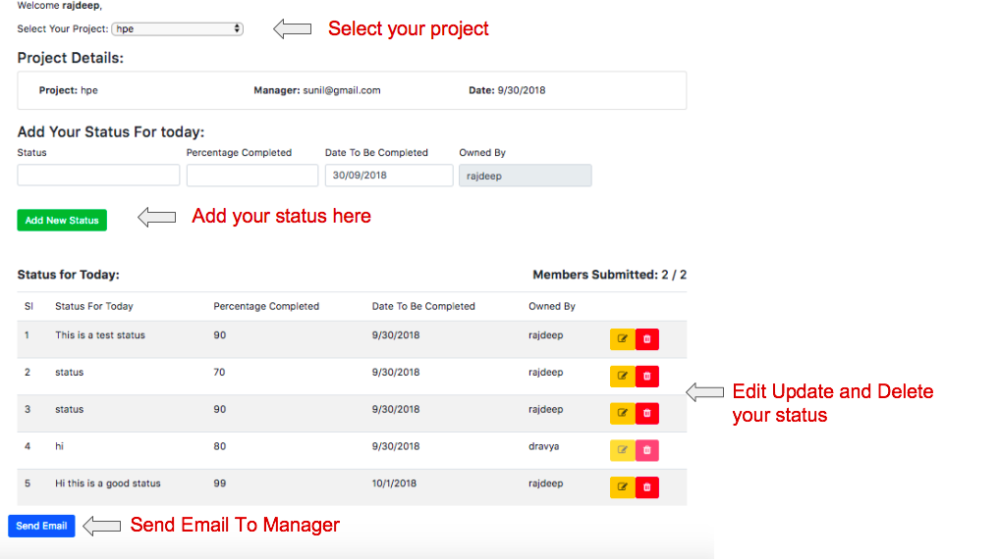

## Training Tracking Application 

This project could help organization to track new joinees or project members to submit their task status of their assigned tasks so that their supervisor can track each task.

## Overview




### The project has two portals:
 * Admin Portal:
    - Through this portal admin can assign tasks to individuals.
    - Admin can delete a task only if that task is not yet started by the member
    - Admin can delegate the task to other members
    - Admin can assign different projects with tasks to individual

* User Portal: 
    - Once logged in user will be able to see his project, project manager name and his assigned tasks
    - At least one task should be started to post status for that day
    - As he posts his task status he can see his progress.
    - He can edit his tasks for that particular day
    - He can start and end his tasks which will show as completed.


### Getting Started

To get you started you can simply clone the repository:

```
git clone https://github.com/Rajdeepc/candidate-training-tracker.git
```


### Pre-requisites
Download express,mongodb and mongoose from the below sites:
 - Express [https://www.npmjs.com/package/express](https://www.npmjs.com/package/express)
 - Mongoose [https://www.npmjs.com/package/mongoose](https://www.npmjs.com/package/mongoose)
 - MongoDB [https://www.npmjs.com/package/mongodb](https://www.npmjs.com/package/mongodb)


### Run in Local

To Run Locally Steps to follow:

* npm run serve at the root of the project
* cd src/node-backend
    - nodemon app.js (install npm  install nodemon -g)

### Built With

* [vue js](https://github.com/vuejs/vue).
* [mongodb](https://github.com/mongodb/mongo)


<<<<<<< HEAD
### Contributing Guidenlines
=======
## Contributing

### Create a branch

1. `git checkout master` from any folder in your local `https://github.com/Rajdeepc/candidate-training-tracker` repository
1. `git pull origin master` to ensure you have the latest main code
1. `git checkout -b the-name-of-my-branch` (replacing `the-name-of-my-branch` with a suitable name) to create a branch

### Make the change

1. Follow the "Running locally" instructions
1. Save the files and check in the browser
  1. Changes to React components in `src` will hot-reload
  1. Changes to markdown files in `content` will hot-reload
  1. If working with plugins, you may need to remove the `.cache` directory and restart the server


### Push it

1. `git add -A && git commit -m "My message"` (replacing `My message` with a commit message, such as `Fixed header logo`) to stage and commit your changes
1. `git push my-fork-name the-name-of-my-branch`
1. Go to the [vue-node-traning-tracker repo](https://github.com/Rajdeepc/candidate-training-tracker) and you should see recently pushed branches.
1. Follow GitHub's instructions.
1. If possible, include screenshots of visual changes. A Netlify build will also be automatically created once you make your PR so other people can see your change.
>>>>>>> c5a8fb134953d85c7d3d491ce754659df18381ae

See [Contributing Guidelines](CONTRIBUTING.md) for details

### License

This project is licensed under the GPL License - see the [LICENSE.md](LICENSE.md) file for details

### Donate

If you like my work and if my product has helped you in your development please feel free to give a shoutout:

[](https://paypal.me/RajdeepC?locale.x=en_GB)

### Become a Patreon
Made for developers and designers by Rajdeep Chandra. Tip me on [Patreon](https://www.patreon.com/chandraraj).
